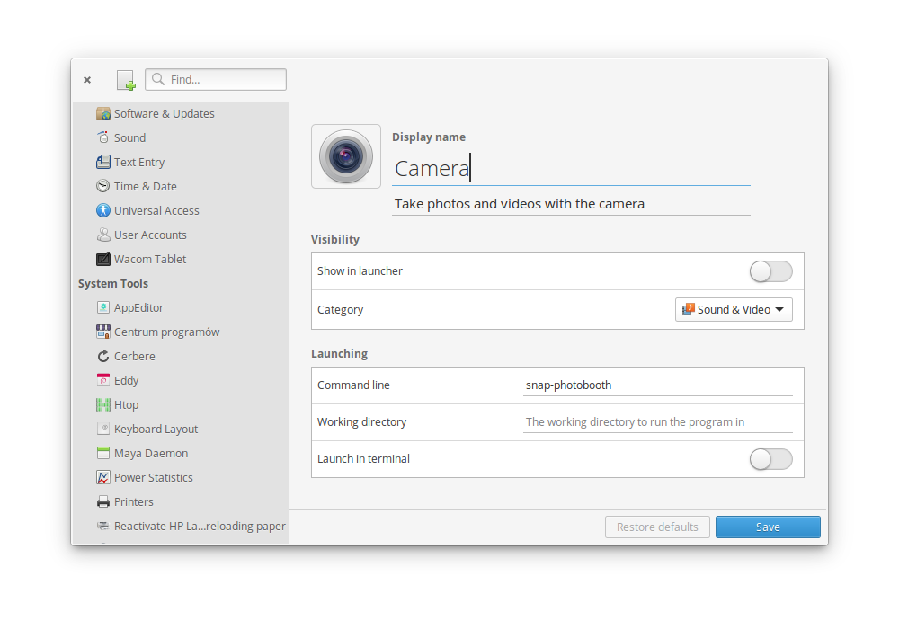

# AppEditor
### Edit application menu



AppEditor allows you to edit application entries in the application menu. Some of its features include:

* Hide and show applications from the application menu
* Create new application entries
* Change application's display name, icon and more

## Installation
[](https://appcenter.elementary.io/com.github.donadigo.appeditor)

### Dependencies
These dependencies must be present before building
 - `valac`
 - `gtk+-3.0`
 - `granite`
 - `meson`
 - `gettext`

 **You can install these on a Ubuntu-based system by executing this command:**

 `sudo apt install valac libgranite-dev meson gettext`

 ### Building
```
meson build
cd build
meson configure -Dprefix=/usr
ninja
```

### Installing & executing
```
sudo ninja install
com.github.donadigo.appeditor
```

### Reporting bugs & debugging
When reporting a bug you should include as much information as possible, that is the system that you're running, what you did in order to have the bug appear and probably a simple list of steps on how to reproduce the issue, however it is not required as some issues are not easily reproducible.
